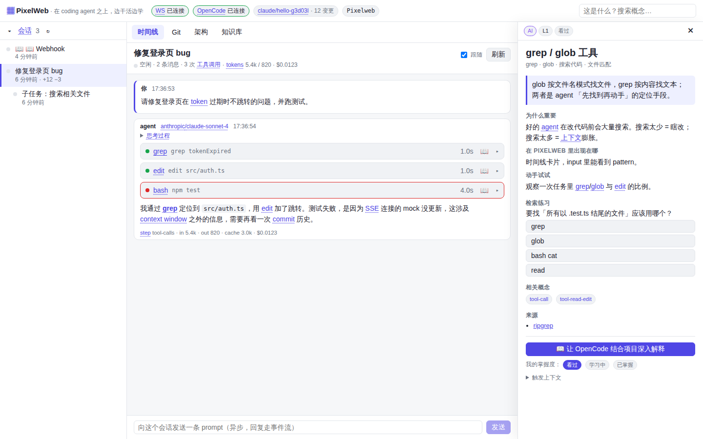
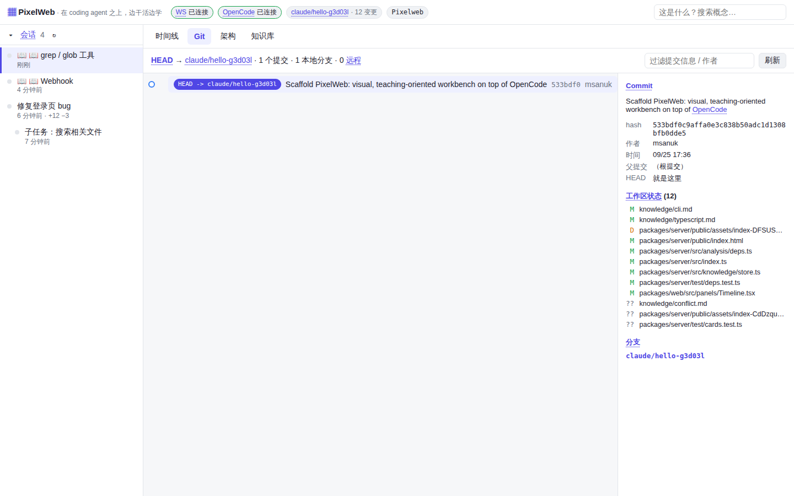
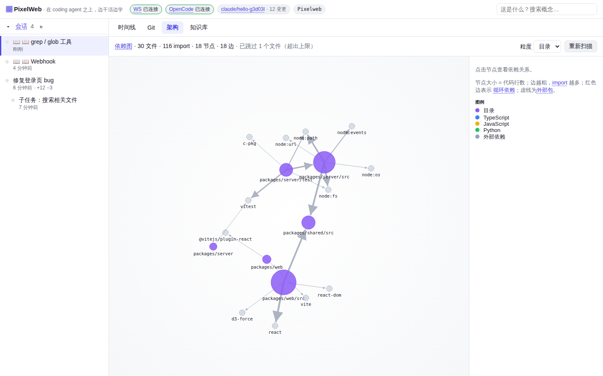
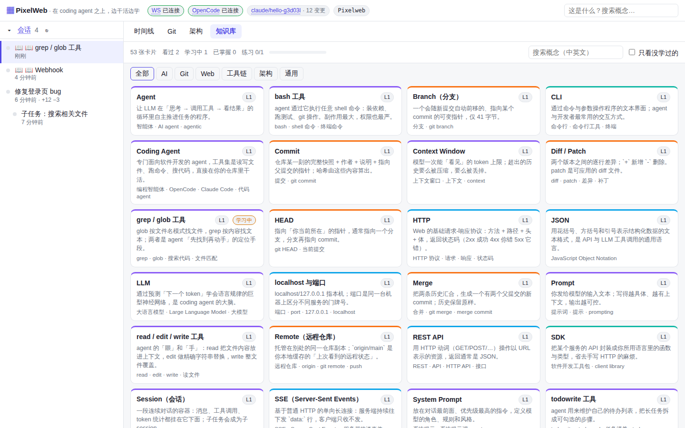

<div align="center">

# PixelWeb

OpenCode 的可视化面板，用来看懂 agent 在你的项目里做了什么。

[快速开始](#快速开始) · [配置](#配置) · [部署](docs/deployment.md) · [浏览器插件](packages/extension/README.md) · [知识卡片](knowledge/README.md)



</div>

## 简介

PixelWeb 连接 [OpenCode](https://opencode.ai) 的 `opencode serve`，订阅它的事件流，把会话、Git 历史和模块依赖画成图。界面上出现的术语，比如 tool call、context window、rebase、CORS，点一下就能看到对应的中文知识卡片。

模型调用和工具执行都在 OpenCode 里完成。PixelWeb 负责展示，也可以在界面里继续对话、批准权限请求。

## 功能

- 时间线显示每个会话的消息、工具调用、token 用量和费用、上下文占用、prompt 缓存命中率、权限请求和 todo。
- Git 分支图显示 HEAD、远程分支、工作区状态和 stash，文件变化后自动刷新。agent 提交的 commit 会关联到产生它的会话。
- 架构图根据 import 语句生成模块依赖（TS / JS / Python），标出循环依赖，并高亮当前会话读过和改过的文件。
- 用量页按模型、按天统计 token 和缓存命中率。
- 知识库有 70 多张中文卡片，分 AI、Git、Web、工具链、架构、云几类。每张卡片有定义、使用场景、练习题和参考链接。
- 在卡片上可以让 OpenCode 结合当前项目再讲一遍。讲解会话不能改文件，执行 shell 命令前都会询问。
- 同一个 `opencode serve` 下的多个项目可以在顶栏切换。
- 配套的 Chrome 插件可以把阿里云、AWS 等控制台的配置页发给 PixelWeb，由 agent 结合项目代码说明每一项该怎么填，见 [packages/extension](packages/extension/README.md)。

| Git | 架构 | 知识库 |
| --- | --- | --- |
|  |  |  |

## 快速开始

需要 Node.js 20.19 或更高版本、git，以及已安装的 [OpenCode](https://opencode.ai/docs/)。

在要观察的项目里启动 OpenCode 的 HTTP 服务（默认端口 4096）：

```bash
cd ~/your-project
opencode serve
```

另开一个终端，构建并启动 PixelWeb：

```bash
git clone https://github.com/msanuk/Pixelweb.git
cd Pixelweb
npm install
npm run build
node packages/server/dist/index.js --project ~/your-project
```

然后打开 <http://127.0.0.1:7420>。

## 配置

每个选项都可以用命令行参数或环境变量设置，两者同时存在时以参数为准。

| 参数 | 环境变量 | 默认值 | 说明 |
| --- | --- | --- | --- |
| `--opencode <url>` | `PIXELWEB_OPENCODE_URL` | `http://127.0.0.1:4096` | `opencode serve` 的地址 |
| `--opencode-username <name>` | `OPENCODE_SERVER_USERNAME` | `opencode` | OpenCode 的用户名 |
| `--opencode-password <pw>` | `OPENCODE_SERVER_PASSWORD` | | OpenCode 设置了密码时填写 |
| `--project <dir>` | `PIXELWEB_PROJECT` | 当前目录 | 启动时打开的项目 |
| `--port <n>` | `PIXELWEB_PORT` | `7420` | 端口 |
| `--host <addr>` | `PIXELWEB_HOST` | `127.0.0.1` | 监听地址 |
| `--password <pw>` | `PIXELWEB_PASSWORD` | | 访问 PixelWeb 的密码 |
| `--data-dir <dir>` | `PIXELWEB_DATA_DIR` | `~/.pixelweb` | 学习记录、插件 token 等数据的存放位置 |
| `--verbose` | `PIXELWEB_VERBOSE=1` | | 打印收到的每个 OpenCode 事件 |
| `--no-title-date` | `PIXELWEB_TITLE_DATE=0` | | 不给会话标题加日期前缀 |

OpenCode 的地址和账号可以在运行时修改：设置（<kbd>⌘</kbd> <kbd>,</kbd> / <kbd>Ctrl</kbd> <kbd>,</kbd>）→ 连接。在界面里切换的项目和连接只对本次运行有效，重启后恢复为启动参数。

会话标题默认整理成 `yyyymmdd-动词对象` 的格式，比如 `20260928-修复登录跳转`。配置方法见 [docs/session-naming.md](docs/session-naming.md)。

## 部署

PixelWeb 需要读取项目的源码和 git 仓库，所以要和 `opencode serve`、项目文件在同一台机器上运行。

```bash
node packages/server/dist/index.js --project /path/to/project --host 0.0.0.0 --password <访问密码>
```

> [!WARNING]
> PixelWeb 能向 agent 发送指令、批准 shell 命令。监听 `127.0.0.1` 以外的地址时必须设置 `--password`，并通过 HTTPS 反向代理或 SSH 隧道访问。

反向代理、系统通知和用 pm2 常驻运行的说明见 [docs/deployment.md](docs/deployment.md)。

## 开发

```bash
npm install
npm run dev          # 后端 :7420（tsx watch）+ 前端 :5173（Vite，代理 /api 和 /ws）
npm run dev:mock     # 模拟的 opencode serve（:4096），带示例会话，没装 OpenCode 时用
npm run typecheck
npm test
```

`npm run dev` 用到了 shell 的 `&`，Windows 上请改用 `npm run build` 和 `npm start`。

```
packages/
  shared/      前后端共用的类型和 WebSocket 协议
  server/      Fastify 服务：连接 OpenCode、读取 git、分析依赖，提供 /api 和 /ws
  web/         React 前端
  extension/   云控制台向导的 Chrome 插件
knowledge/     知识卡片
docs/          设计文档和部署说明
```

数据流是 `opencode serve` → SSE → `server` → WebSocket → `web`。浏览器只访问 PixelWeb 自己的地址，所有 OpenCode 请求都由服务端代理。各模块的细节写在 [CLAUDE.md](CLAUDE.md) 里。

### 添加知识卡片

卡片是带 frontmatter 的 Markdown 文件，格式见 [knowledge/README.md](knowledge/README.md)。`npm test` 会解析并校验每一张卡片。不想提交到仓库的卡片可以放在 `~/.pixelweb/knowledge/` 或 `<项目>/.pixelweb/knowledge/`，同 id 的卡片后加载的生效。

## 路线图

- [ ] 支持 Claude Code、Codex CLI 等其他 agent（实现和 `opencode/client.ts` 相同的事件接口）
- [ ] 用 tree-sitter 做更准确的依赖分析，加上调用图
- [ ] 根据学习记录安排卡片复习（间隔重复）
- [ ] 以 MCP server 的形式提供 PixelWeb，让 agent 主动讲解它刚做过的改动

## 致谢

- [OpenCode](https://opencode.ai)
- 讲解功能的教学方法参考了 Matt Pocock 的 [teach skill](https://github.com/mattpocock/skills)
